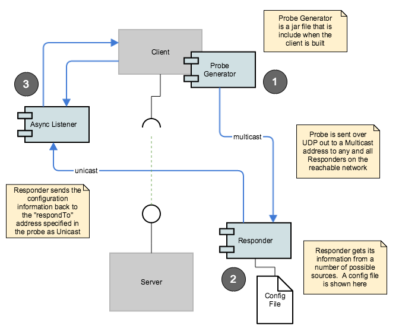

## Argo Component Anatomy
 
There are three main components in the Argo Protocol.

1. The Probe Generator that is likely embedded in a service client application.
1. The Responder which may be a daemon on a host or embedded in some service container (e.g. OSGi).
1. The Response Listener which, by protocol should listen asynchronously to replies from client probes.

These components provide the fundamental protocol components, however, there are no prescribed protocol requirements on the implementation of the client or the response listener.  The Responder has prescribed normative behavior.





The Argo component architecture and deployment possibilities are pretty flexible.  Read more on that [here](Argo-Flexible-Architecture).

### The protocol is a very simple probe/response protocol.
* Multicast probe and unicast response.
* No WAN announce/goodbye protocol included.
* Clients need to listen for responses asynchronously.
* Unicast responses for scalability and security as opposed to multicast responses.
* The probe payloads are in XML.

``` xml
<?xml version="1.0" encoding="UTF-8"?>
<probe id="urn:uuid:7ea60f23-7072-4113-aff8-194f906d83d1" contractID="urn:uuid:55f1fecc-bfed-4be0-926b-b36a138a9943">     
    <respondTo>http://7.7.7.12:8181/services/probeResponse</respondTo>
    <respondToPayloadType>XML or JSON</respondToPayloadType>
    <serviceContractID>uuid:03d55093-a954-4667-b682-8116c417925d</serviceContractID>
</probe>
```

A probe can list multiple serviceContractID elements if they want to probe for several service types in one probe.  For example:

``` xml
<?xml version="1.0" encoding="UTF-8"?>
<probe id="urn:uuid:7ea60f23-7072-4113-aff8-194f906d83d1" contractID="urn:uuid:55f1fecc-bfed-4be0-926b-b36a138a9943">     
    <respondTo>http://7.7.7.12:8181/services/probeResponse</respondTo>
    <respondToPayloadType>XML or JSON</respondToPayloadType>
    <serviceContractID>uuid:03d55093-a954-4667-b682-8116c417925d</serviceContractID>
    <serviceContractID>uuid:6f371517-4bba-489e-b733-b2230194811d</serviceContractID>
    <serviceContractID>uuid:140aad15-dcf8-42d2-9f1f-85ad605fb3e4</serviceContractID>
</probe>
```

Clients are supported by a jar file for Probe generation.  Probe generation should be very simple for the client.  A probe specifies which service types it's interested in by listing the individual service contract IDs in the probe.  A probe with no contract ID connotes a “select all” - which return ALL services in the reachable network.  So be careful with that one.  But it could be useful for “Service Situational Awareness/monitoring” and other such cool Run-time Service Discovery use-cases we haven’t thought of yet.

Response payloads are in XML or JSON are are described in detail here.  However, here is a XML example of a response payload.

``` xml
<?xml version="1.0" encoding="UTF-8"?>
    <services responseID=”the unique response ID” probeID=”the probeID that instigated this response”>
    <service id="the unique ID of the service instance” contractID="the contract ID that will match the probe">
        <ipAddress>Some IP Address</ipAddress>
        <port>some port</port>
        <url>some URL to a REST/SOAP or other access location</url>
        <description>The human readable description</description>
        <serviceName>The human readable short name of the service</serviceName>
        <contractDescription>human readable desc of the contract</contractDescription>
        <data><![CDATA[This is some CDATA text]]></data>
        <ttl>expected valid lifetime of this response</ttl>
        <consumability>HUMAN_CONSUMABLE or MACHINE_CONSUMABLE </consumability>
    </service>
 
    … more service …
 
  </services>
```

**Asynchronous Response Listeners** should are supported by an “out of the box” component but can be easily custom built.  There are two clients for a Listener.  The Responder sends response payloads to a Listener via the URL provided in the "respondTo" probe payload.  Also the client application retrieves received responds from the Listener.  Both Listener APIs are REST services (but the client facing API could be a direct Java call).  

**Asynchronous Response Listeners** should be deployed on a small device if possible.  They also need to be multi-threaded inbound REST service containers - small JAX-RS containers or basic HTTP servers come to mind. Further, Asynchronous Response Listeners do not have to be deployed on the same machine as the effective service client.  In fact, for certain cybersecurity reasons, the Asynchronous Response Listeners probably should be deployed on a separate machine, unless that is impractical - for example the client and the listener need to be installed on a mobile device. 

**The Responder** is “extensible” via custom “plug-ins” for handling probes.  Currently, the "out of the box" plug-in probe handler includes the Config File but could easily be extended to include plug-ins for, UDDI (maybe), Apigee, Layer 7, Netflix eureka, and your Simple Registry.  Next generation of plugins might include adaptors for local-link protocols such as mDNS/Bonjour, SLP and other domain-specific protocols such as ServiceNow, Hadoop ZooKeeper/Curator, Serif, dozerd, etcd and others.

**Responders** need to deal with multiple probes with the same ID - process the first and drop the rest - time-spread UDP packets with identical payloads help reliability.  Responders will need to perform multi-threaded handling of inbound UDP packets for obvious reasons.  Responder plug-ins should be shielded from multicast handling and response payload generation/sending as much as possible.