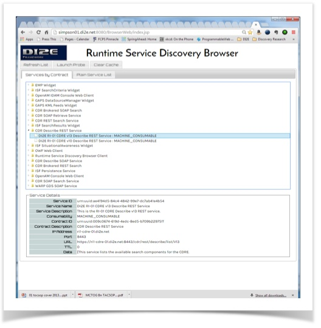
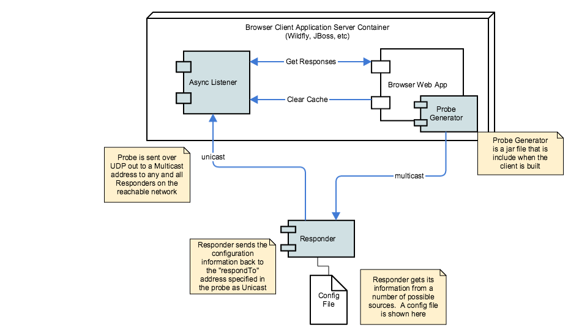

The Browser is a simple web application (actually 2 web apps) that will list out the services available on the current network.  It's not really intended to be a complete and polished application.  It's intended to show how to build a client that can probe the network for services and get answers back from the network asynchronously.  Argo is not a synchronous protocol, you don't send a request (probe) and wait for a reply like you would with a central registry service.  It can't work that way.  The Browser has a listener service that will asynchronously field responses from probes that reach a Responder that cares to respond.

The code for the browser is available on [Github](https://github.com/di2e/Argo/tree/master/BrowserWeb) 

You can install and use as many Browser applications as you like.

The current sample Argo Browser client looks like this:



The usage of the Browser is pretty simply.  When the Browser launches in a web page, it will display the services that it has in its local cache (more on that in a minute).
To search the network for services and update the list, press the "Launch Probe" button.  If the probe was send successfully, then you'll get an annoying alert dialog telling you.
To refresh the list of services in the UI, press the "Refresh List" button.  This will retieve all of the service records currently in the Browser's cache.
If you would like to clear the cache, press the "Clear Cache."  If you then press "Refresh List," you'll get a blank list.  If you then launch a probe, wait a second or two, then press "Refresh List" and you should see all the services available on the network.
Again, this is not supposed to be a "good" application.  Heaven knows it's not.  I grimace every time I look at it now.  However, it is a canonical and simple example of how to build an Argo service discovery client.
sssssss
Basic Client Architecture



This is the basic architecture of the Browser Application (which is the basic architecture of all Argo apps). The Browser and the AsyncListener really need to paired together to make a fully functioning client.
The AsyncListener.war and the BrowserWeb.war need to be deployed into some JAX-RS capable container (e.g. WildFly, JBoss, WebLogic, etc).
 The Browser client app send out a Probe. The probe contains a list of the service contract IDs the client is interested in and the URL of the "respondTo" address (e.g. the URL of the Asynch Listeners probe response REST API). For more detail on how the Argo protocol works, please see the Argo Protocol and Rationale page. However, the Browser client app actually puts out a probe with no service contract IDs - which means, by protocol, that the network should respond with all services. Kind of a "select all."

The Browser client application requires some type of asynchronous listener for replies from probes. A client can create whatever type of listener it likes, however, the Browser client app uses a listener that is capable of receiving replies from Responders that have decided that they should respond to the probe. Probes are "fire and forget" types of requests. There is no synchronous reply from a discovery probe.
The AsynchListener supplied with the Browser client application also has a simple cache built into it. When probe responses come in from a Responser, the AsynchListener puts it into it's cache. That's it. It could do more, like ping the Browser app that a new service record showed up. But let's not get crazy.

## Argo Browser Installation

Installing the Argo Browser is really simple.  The prerequisite for this installation is to have a JAX-RS compliant container installed and working.  Argo has been tested with JBoss 7.1 and Wildfly 8.2.  I recommend Wildfly mostly because it has a better name than JBoss - and it's newer.

* First download the BrowserWeb.war and AsynchListener.war from the Argo Github site.
* Then deploy the AsynchListener.war.  No special configuration is necessary.
* Then deploy the BrowserWeb.war.  You need to create an `argoClient.prop` file in `$ARGO_HOME/config`.  This config file controls how many probes to send and what the respondTo IP addresses are for the probes.  This is important for complex network environments.  You likely don't need to change this default and you will know when you will have to. The config file looks like this:

```
#multicastPort=4003
#multicastGroupAddr=230.0.0.1
#listenerProbeResponseURLPath=/AsynchListener/api/responseHandler/probeResponse
#listenerResponsesURLPath=/AsynchListener/api/responseHandler/responses
#listenerClearCacheURLPath=/AsynchListener/api/responseHandler/clearCache

#No value for listenerIPAddress means that the ProbeGenerator should use the localhost address
networkInterfaceName=en0
listenerIPAddress=
listenerPort=8080
respondToIPAddress.1=
respondToPort.1=8080
respondToIPAddress.2=192.168.1.100
respondToPort.2=8080
```
If the `networkInterfaceName` is set then all blank IP address properties will default to the IP address associated with that Network Interface name.  If there is no Network Interface with that name, then all blank IP address properties will default to the network interface and IP address associated with `localhost`

* To launch the browser go to the following URL: http://\<ipaddress\>:\<host\>/BrowserWeb/index.html

That is.  Launch a couple probes.  See what's in the cache.  It'll be fun.

## Additional optional configuration

You can further customize the behavior of the Browser by providing a configuration file called `$ARGO_HOME/config/argoClient.prop`.  The Browser looks for this file first and if it can't find it will use default values.

That is.  Launch a couple probes.  See what's in the cache.  It'll be fun.
If you don't find any services, then there probably aren't any Responders running in your network.  To test the Browser, install a Responder locally and configure a couple of test service records.